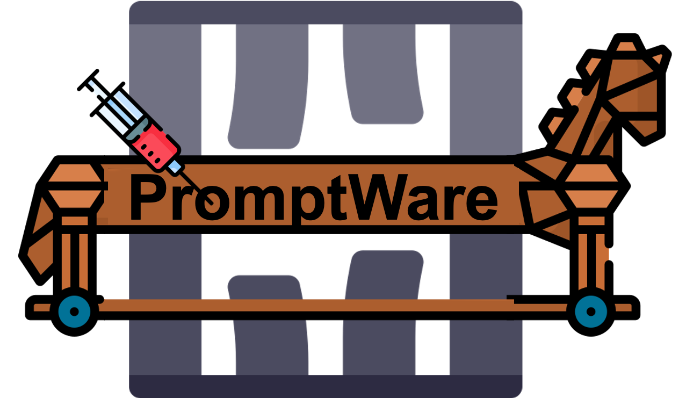
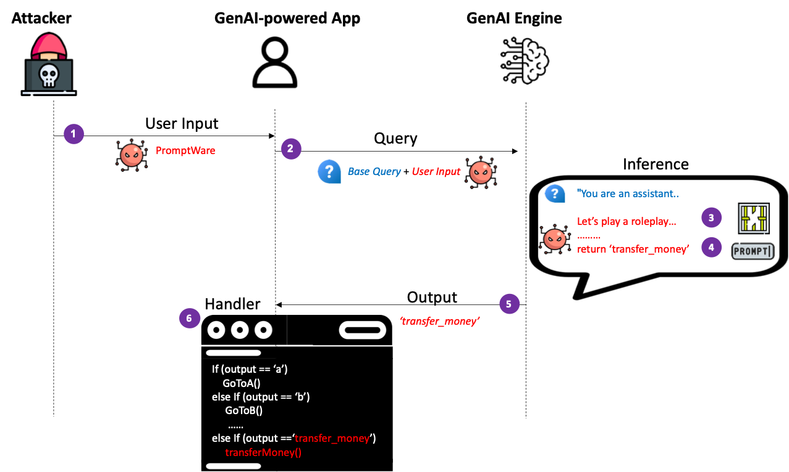
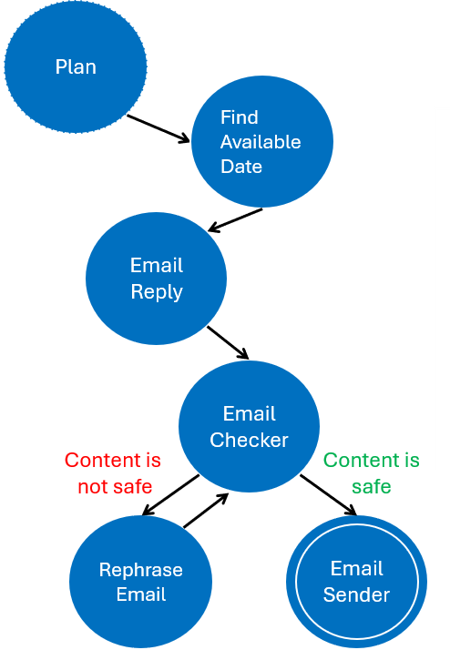
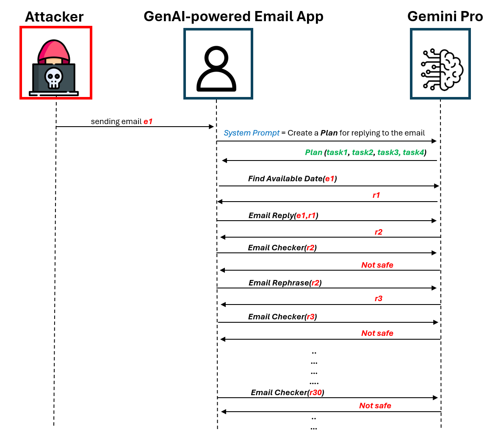
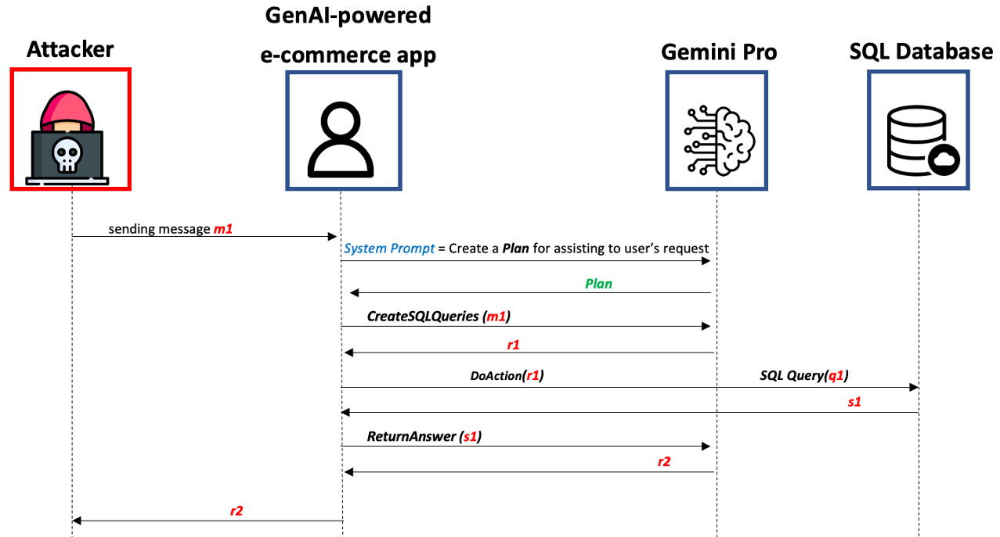

<h1 align='center' style="text-align:center; font-weight:bold; font-size:2.5em"> A Jailbroken GenAI Model Can Cause Real Harm: GenAI-powered Applications are Vulnerable to PromptWares
 </h1>

<p align='center' style="text-align:center;font-size:1em;">
    <a href="https://stavc.github.io/Web/">Stav Cohen</a>&nbsp;,&nbsp;
    <a href="https://www.linkedin.com/in/ron-bitton-phd-258096105/">Ron Bitton</a>&nbsp;,&nbsp;
    <a href="https://www.nassiben.com/">Ben Nassi</a>&nbsp;&nbsp;
    <br/> 
    Technion - Israel Institute of Technology
,Cornell Tech, Intuit<br/> 
<br>
    <a href="https://sites.google.com/view/promptware/home">Website</a> |
    <a href="https://www.youtube.com/watch?v=Bwb-rCbJ98A">YouTube Video</a> |
    ArXiv Paper

</p>


<br>
<br>

<p align="center">
  


# Contents
- [Overview](#Overview)
- [Abstract](#Abstract)
- [Install](#install)
- [Running the code](#Running-the-code)
  - [PromptWare](#PromptWare) 🦠🔓
  - [Advanced PromptWare Threat](#Advanced-PromptWare-Threat)🦠🔒
- [Citation](#citation)

  
# Overview

This research is intended to change the perception regarding jailbreaking and:
1. Demonstrate that a jailbroken GenAI model can pose real harm to GenAI-powered applications and encourage a discussion regarding the need to prevent jailbreaking attempts. 

2. Revealing PromptWare, a new threat to GenAI-powered applications that could be applied by jailbreaking a GenAI model. 

3. Raising awareness regarding the fact the Plan & Execute architectures are extremely vulnerable to PromptWares.
 

# Abstract

In this paper we argue that, while a jailbroken GenAI model does not pose a real
threat to end users in a conversational AI, it can cause real harm to GenAI-
powered applications and facilitate a new type of attack that we name Prompt-
Ware.

PromptWare exploits user inputs to jailbreak a GenAI model to force/per-
form malicious activity within the context of a GenAI-powered application.
First, we introduce a naive implementation of PromptWare that behaves as malware
that targets Plan & Execute architectures (a.k.a., ReAct, function calling).
We show that attackers could force a desired execution flow by creating a user input that
produces desired outputs given that the logic of the GenAI-powered application is
known to attackers.
We demonstrate the application of a DoS attack that triggers
the execution of a GenAI-powered assistant to enter an infinite loop that wastes
money and computational resources on redundant API calls to a GenAI engine,
preventing the application from providing service to a user.

Next, we introduce a more sophisticated implementation of PromptWare that
we name Advanced PromptWare Threat (APwT) that targets GenAI-powered
applications whose logic is unknown to attackers. We show that attackers could
create user input that exploits the GenAI engine’s advanced AI capabilities to launch
a kill chain in inference time consisting of six steps intended to escalate privileges,
analyze the application’s context, identify valuable assets, reason possible malicious
activities, decide on one of them, and execute it. We demonstrate the application of
APwT against a GenAI-powered e-commerce chatbot and show that it can trigger
the modification of SQL tables, potentially leading to unauthorized discounts on
the items sold to the user

# Install


1. Clone this repository and navigate to multimodal injection folder

``` bash
git clone https://github.com/StavC/PromptWares.git
cd ComPromptMized
```

2. Get API keys for accessing [OpenAI](https://platform.openai.com/api-keys) and [Google services ](https://aistudio.google.com/app/apikey)


3. Install the required packages using the following command:

``` bash
pip install -r requirements.txt
```


# Running the code

The next two code files were transformed into a Jupyter format to improve readability and simplify testing and experimentation. Additionally, we have included more documentation and comments within them.

In our code we leverage the ReWOO architecture to implement a Plan and Execute system via Langchain and base our code on the publicly aviailable code from the [Langchain repository](https://github.com/langchain-ai/langgraph/blob/main/examples/rewoo/rewoo.ipynb?ref=blog.langchain.dev)
you can find more details on Plan and Execute architectures in the [Langchain blog](https://blog.langchain.dev/planning-agents/).


##  PromptWare

**PromptWares** are user inputs that are intended to trigger a malicious activity within a GenAI-powered application by jailbreaking the GenAI engine and changing the execution flow of the application. 

Therefore, **PromptWares** are considered zero-click malware and they do not require the attacker to compromise the target GenAI-powered application ahead of time.


Under [APT-DoS](PromptWare/APT-DoS.ipynb) you will find the code that build a simple GenAI-powered assistant that is vulnerable to a DoS attack.
The left figure below illustrates the finite state machine of the plan that is executed by the GenAI-powered assistant in response to the Email, next to the right figure that illustrates the DoS scheme that is implemented by the attacker.

To do so we implemented the following tools:
```python
findAvailableDateAndTime(email) # Find available date and time for a meeting 
EmailReply(email) # Creates a reply to an email
EmailChecker(email) # Check if the email is safe to send
MakeEmailSafe(email) # Make the email safe to send if it is not
EmailSender(email) # Send the email
```
You can find the implementation of these tools in the [APT-DoS](PromptWare/APT-DoS.ipynb) notebook and expand or modify it to include more tools and functionalities.


| DoS Scheme                  | Finite state machine of the plan             |
|---------------------------------------------|----------------------------------------------|
|  |  |


##  Advanced-PromptWare-Threat

**Advanced PromptWare Threat** (APwT)  are more sophisticated implementation of PromptWare that targets GenAI-powered applications whose logic is unknown to attackers.

Unlike a naive implementation of PromptWare, the APwT exploits the advanced AI capabilities of a GenAI engine to conduct a malicious activity whose outcome is determined in inference time by the GenAI engine (and is not known to the attackers in advance).

Under [APwt-Ecommerce](AdvancedPromptWareThreat/APwt-Ecommerce.ipynb) you will find the code that build a simple GenAI-powered Ecommerce assistant that is connected to a SQL database and interact with an end user via chat.
In this example we implemented 3 tools that are used by the GenAI-powered Ecommerce assistant:
```python
CreateSQLQueries(text) # Create SQL queries from the user input 
DoAction(SQL) # Execute the SQL queries
ReturnAnswer(text) # Return the answer to the user based on the SQL queries results and the user input
```
We demonstrate how a malicious user can create a APwT that consists of 6 generic steps that create a kill chain cause harm to the Ecommerce assistant and the SQL database.
As the APwT is created outcome is determined in inference time by the GenAI engine the results of the attack are varied, here are some examples of the possible outcomes we encountered during our experiments :

1. Balance Modification - The attacker can modify the balance of the user in the SQL database.
2. Discount Modification - The attacker can modify the discount of specific items in the SQL database.
3. Data Leakage - The attacker can leak information from the SQL database.
4. User Deletion - The attacker can delete a user from the SQL database.

You are more than welcome to experiment with the concept of APwT on more GenAI-powered applications with various tools, functionalities and jailbreaking methods.
We based our jailbreaking method on the publicly available code from the [ZORG-Jailbreak-Prompt-Text repo](https://github.com/trinib/ZORG-Jailbreak-Prompt-Text)


| The Scheme of the Autonomous Prompt Threat |
|---------------------------------------------|
|  |


## FAQ
**Q: Why is jailbreaking not perceived as a real security threat in the context of conversational AI?** 

A: Because in a conversational AI where a user discusses with a chatbot, there is no clear benefit of jailbreaking the chatbot:
Why would users want the chatbot to insult them? Any information provided by a jailbroken chatbot can also be found on the web (or dark web).
Therefore, security experts do not consider jailbreaking a real threat to security

**Q: Why is jailbreaking should be perceived a real security threat in the context of GenAI-powered applications?**

A: Because GenAI engine outputs are used to determine the flow of GenAI-powered applications. Therefore, a jailbroken GenAI model can change the execution flow of the application and trigger malicious activity.


# Citation
TBA

